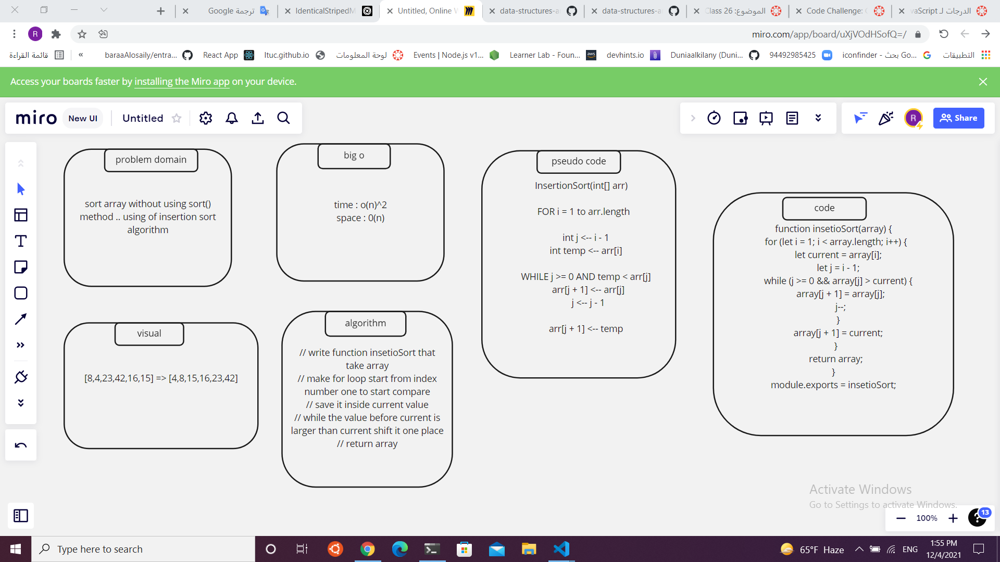
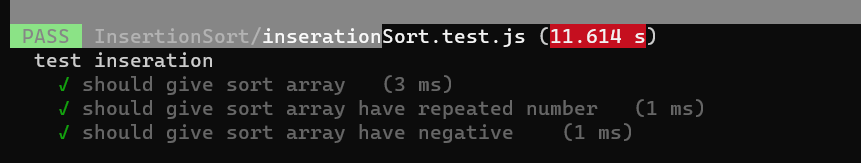

Code Challenge: Class 26 / Insertion Sort - JS Implementation
By raneem abu jamous
Introduction
Insertion Sort is a sorting algorithm that traverses the array. For each passthrough, the current value at index i is repeatedly compared to the value at the previous index and swapped until the previous value is smaller than the current value. The array is sorted in place.

