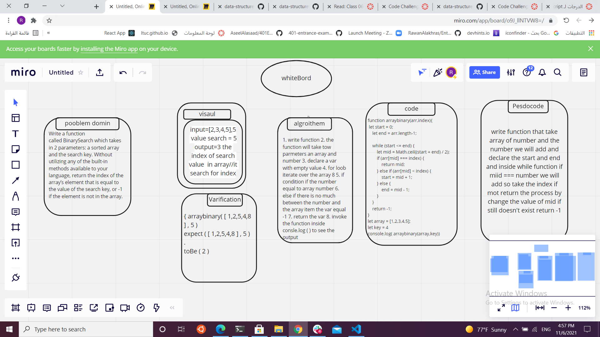

# Binary Search of Sorted Array

function that recieve two parameter first is an array secound is a key and should return index of key .

## Whiteboard Process

<!-- Embedded whiteboard image -->

## Approach & Efficiency

write function that take array of number and the number we will add and declare the start and end and inside while function if miid === number we will add so take the index if mot return the process by change the value of mid if still doesn't exist return -1

thank you
