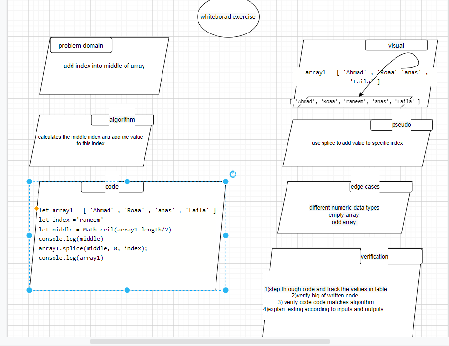

## array-insert-shift

add index into middle of array

## Whiteboard Process

## Approach & Efficiency

calculate the middle index and using the method of array to add new value into middle of array
