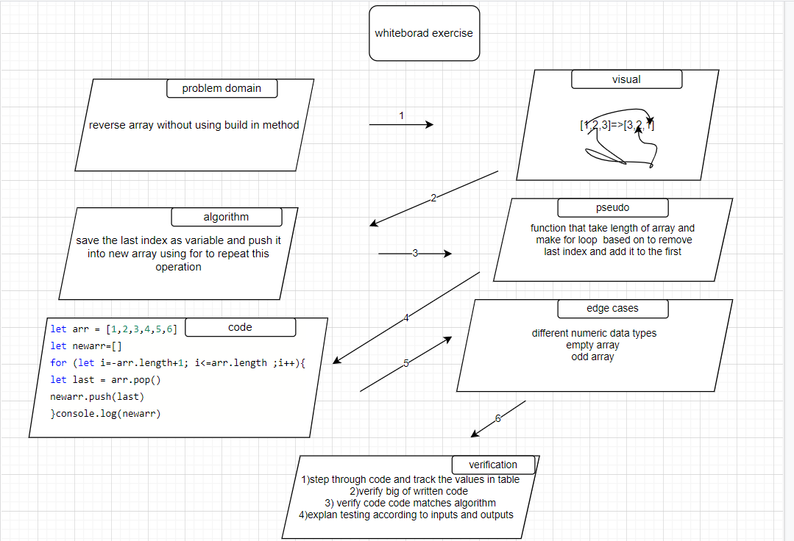

# Reverse an Array

i should make the last element in the first and the first one in the end we just should reverse element

## Whiteboard Process

## Approach & Efficiency

swap the first index with the last index continue swapping up to the middle of the array use a variable to save first index as you replace it with the last index from the array insert the variable as the last index.
