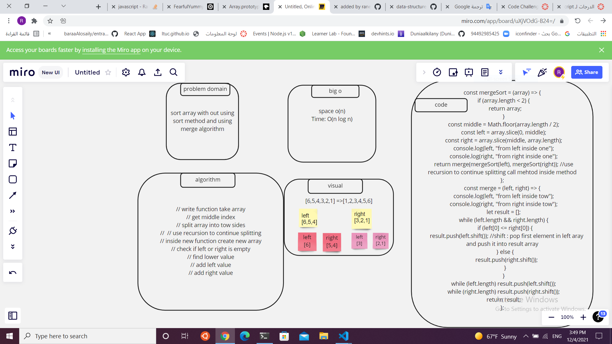
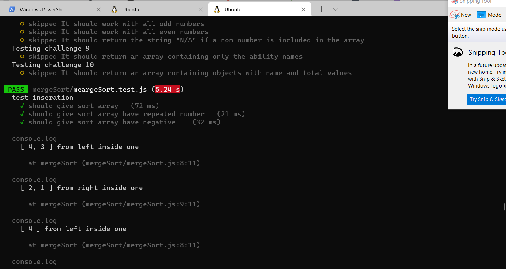

### Code Challenge: Class 27 / Merge Sort - JS Implementation

By raneem abu jamous
Introduction
Merge Sort is a sorting algorithm that splits up the values of an array and then merges them in a sorted order. It is a very efficient sorting algorithm - O(n log n).

