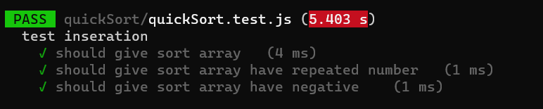
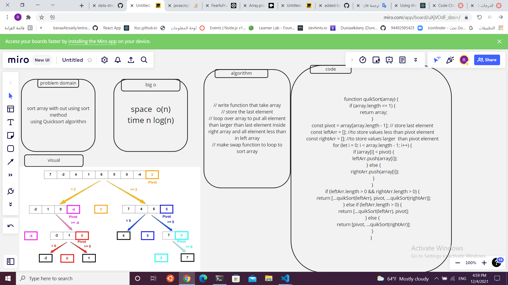

Code Challenge: Class 28 / Quick Sort - JS Implementation
By raneem abu jamous
Introduction
Quick sort is a sorting algorithm that splits up an array into equal parts and sets a pointer to both ends of the array and a pivot in the middle of the array. If the left value is greater than the pivot and the right is less than the pivot they are swapped. This is done recursively until the pointers meet in the middle. It is a very efficient sorting algorithm - O(log n).

