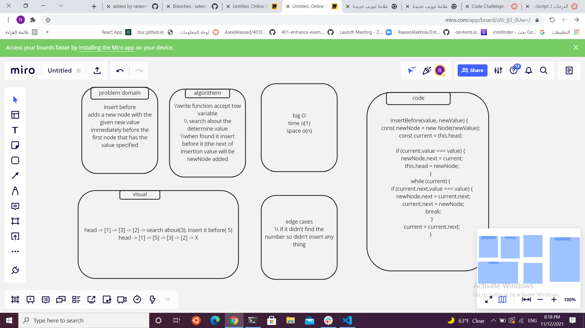

# Challenge Summary

<!-- Description of the challenge -->

1-append
arguments: new value
adds a new node with the given value to the end of the list
2-insert before
arguments: value, new value
adds a new node with the given new value immediately before the first node that has the value specified
3-insert after
arguments: value, new value
adds a new node with the given new value immediately after the first node that has the value specified

## Whiteboard Process

<!-- Embedded whiteboard image -->

## Approach & Efficiency :

understood the problem first
I imagined how the results should be
I made a drawings of how the linked list would be after insertion of multiple nodes Linked-List.
I wrote the code
I made the tests

## API

append(): appends an new node with given value to the end of the list.
insertBefore(): adds a new node with give value before specified value node.
insertAfter(): adds a new node with give value after specified value node.
